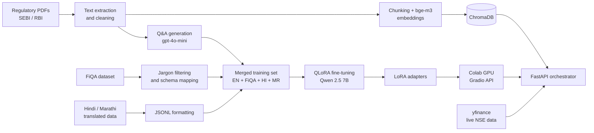

# 📈 BharatFinanceEdu (RelicLLM)

BharatFinanceEdu is an AI-powered, multilingual financial educator for Indian retail investors. The project covers the full pipeline: building an educational finance dataset, fine-tuning a 7B LLM (Qwen 2.5) on it, grounding the model with an offline RAG knowledge base of SEBI and RBI guidelines, connecting it to live NSE market data, and serving everything through a FastAPI backend with behavioural guardrails that slow users down before impulsive investment decisions.

> **Disclaimer:** BharatFinanceEdu is an educational tool. It is not a SEBI-registered investment adviser and nothing it returns is investment advice.

---

## Table of contents

1. [Why this project exists](#why-this-project-exists)
2. [Project pipeline](#project-pipeline)
3. [Data preparation](#data-preparation)
4. [Model training](#model-training)
5. [RAG knowledge base and market data](#rag-knowledge-base-and-market-data)
6. [Hosting the LLM on Google Colab](#hosting-the-llm-on-google-colab)
7. [Backend architecture](#backend-architecture)
8. [Features](#features)
9. [Setup](#setup)
10. [Running the server](#running-the-server)
11. [API reference](#api-reference)
12. [How the suitability quiz works](#how-the-suitability-quiz-works)
13. [Configuration](#configuration)
14. [Troubleshooting](#troubleshooting)
15. [Known limitations](#known-limitations)

---

## Why this project exists

Most first-time Indian investors make decisions from social media tips, WhatsApp forwards and fear of missing out. Three problems repeat:

| Problem | What BharatFinanceEdu does |
|---|---|
| People buy stocks they do not understand | A "License Before You Buy" quiz built from the stock's live data, with a verdict on where the user is strong and where they are not |
| Impulsive, hype-driven buying | A FOMO and impulse scorer that reads the user's message and the stock's technical stretch |
| Panic selling on sudden drops | A background volatility monitor that sends calm, educational interventions |
| Scam "sure shot" tips from unregistered advisers | An OCR scanner that checks screenshots for SEBI registration numbers and illegal claims |
| Language barriers | Full support for English, Hindi and Marathi, including speech input and output |

---

## Project pipeline

The project is built in five phases:

1. **Data preparation:** build a clean, multilingual, education-focused finance dataset.
2. **Model training:** fine-tune Qwen 2.5 7B with QLoRA on a free T4 GPU.
3. **RAG and market data:** build the offline SEBI/RBI knowledge base and the live stock data layer.
4. **Model hosting:** serve the fine-tuned model from Google Colab through a Gradio API.
5. **Backend:** a FastAPI orchestrator that combines the model, RAG, live data and guardrails into one API.

---

## Data preparation

- **Regulatory text extraction.** Raw SEBI and RBI PDFs are converted to text. Noise such as tables of contents, indexes, headers and footers is stripped, and the cleaned documents are saved for both dataset generation and the RAG knowledge base.
- **Synthetic Q&A generation.** The cleaned text is fed to `gpt-4o-mini` using Pydantic Structured Outputs, which forces every generated sample into a fixed teaching schema: **Explanation, Analogy, Example and Common Misconception**. This produces the base English educational dataset.
- **FiQA filtering.** The FiQA financial Q&A dataset is downloaded from Hugging Face. Corporate and Wall Street jargon (for example EBITDA and swaps) is removed so the remaining questions suit Indian retail investors, and the schema is standardised to match the base dataset.
- **Multilingual data.** A translated spreadsheet of finance Q&A in Hindi and Marathi is parsed and converted into valid JSONL rows in the same schema.
- **Merged master dataset.** English, filtered FiQA, Hindi and Marathi samples are merged into a single training file ready for fine-tuning.

---

## Model training

| Item | Value |
|---|---|
| Base model | `Qwen2.5-7B-Instruct-bnb-4bit` |
| Method | QLoRA (4-bit quantised base with LoRA adapters) |
| Framework | Unsloth |
| Hardware | Free Google Colab T4 GPU |
| Training length | 150 steps |
| Languages | English, Hindi, Marathi |
| Output | LoRA adapters for the fine-tuned BharatFinanceEdu model |

After training, inference is tested in all three languages and the LoRA adapters are exported so the model can be reloaded for serving.

---

## RAG knowledge base and market data
